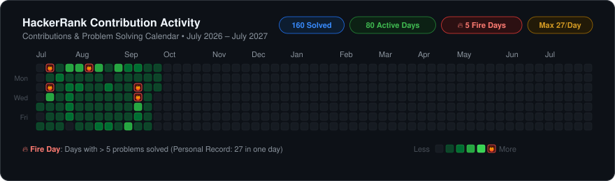

# HackerRank Solutions

A structured repository containing **159** solutions across **Python** and **C++** on [HackerRank](https://www.hackerrank.com/), organized with standardized metadata headers, algorithmic reference modules, and an automated contribution activity heatmap.

---

## 📊 Contribution Activity

<p align="center">
  
</p>

<p align="center">
  
  
  5)-5%20🔥-red?style=flat-square" alt="Fire Days"/>
  
  
  
</p>

---

## 📁 Repository Structure

```text
HACKER RANK/
├── 30 DAYS OF CODE/       # Complete 30 Days of Code track (Day 01–29; 26 Python, 4 C++)
├── CPP/                   # C++ domain problem solutions (12 files)
├── PYTHON/                # Python domain problem solutions (117 files)
├── CORE/                  # Personal Competitive Programming reference library
│   ├── Algorithms.py      # 18 curated algorithms, bit hacks, & number theory techniques
│   ├── Concepts.py        # 13 Python runtime mechanics, complexity laws, & CP idioms
│   ├── Patterns.py        # 12 high-frequency CP problem archetypes & recognition guides
│   ├── PitfallsAndErrors.py # 12 common competitive programming traps, bugs, & fixes
│   └── Templates.py       # 11 production-ready CP data structures & algorithmic templates
├── assets/
│   └── contribution_heatmap.svg  # Generated vector heatmap card
└── scripts/
    └── generate_heatmap.py       # Automated metadata parser & SVG generator
```

---

## 📈 Activity & Milestone Highlights

| Metric | Count | Description |
| :--- | :--- | :--- |
| **Total Solutions** | **159** | Verified solutions with 100% metadata header integrity |
| **Python Solutions** | **143** | 117 domain problems + 26 "30 Days of Code" challenges |
| **C++ Solutions** | **16** | 12 domain problems + 4 "30 Days of Code" challenges |
| **Active Solving Days** | **79** | Distinct dates with confirmed problem solves |
| **Longest Streak** | **35 Days** | Continuous daily solving marathon |
| **Fire Days (`> 5 / day`)** | **5 Days** | High-velocity marathon solving sessions marked with 🔥 |

### 🔥 Fire Days Hall of Fame

Days on which more than **5 problems** were solved:

| Date | Problems Solved | Track / Highlights | Status |
| :--- | :---: | :--- | :---: |
| **2026-07-05** | **27** | Marathon kickoff: Strings, Math, Introduction sets | 🔥 All-Time Record |
| **2026-09-09** | **11** | NumPy and advanced data structures sprint | 🔥 Fire Day |
| **2026-07-07** | **7** | Collections, Itertools, and Basic Data Types | 🔥 Fire Day |
| **2026-08-02** | **6** | Regex and parsing deep dive | 🔥 Fire Day |
| **2026-09-08** | **6** | Linear algebra, matrices, and math challenges | 🔥 Fire Day |

---

## 🧠 Core Competitive Programming Library (`CORE/`)

The [`CORE/`](CORE/) directory contains deep-dive algorithmic references distilled directly from solving competitive programming problems. Each module includes fully self-contained, executable unit tests:

1. **[Algorithms.py](CORE/Algorithms.py)**: Binary exponentiation, GCD/LCM, Sieve of Eratosthenes, prefix sums, two pointers, coordinate compression, and bit manipulation tricks.
2. **[Concepts.py](CORE/Concepts.py)**: Python `dict`/`set` amortized $O(1)$ complexity, hash collision avoidance with random salts, recursion depth mechanics, and generator memory efficiency.
3. **[Patterns.py](CORE/Patterns.py)**: Sliding window, monotonic stack/queue, binary search on answers, meet-in-the-middle, interval scheduling, and BFS/DFS graph traversals.
4. **[PitfallsAndErrors.py](CORE/PitfallsAndErrors.py)**: Mutable default arguments, shallow vs. deep copy traps, floating-point precision, off-by-one index bugs, and TLE prevention.
5. **[Templates.py](CORE/Templates.py)**: Copy-pasteable production implementations of Disjoint Set Union (DSU), Fenwick Tree (BIT), Trie, Fast I/O, and `SafeDict`.

---

## 🔄 Maintaining & Regenerating the Heatmap

The contribution heatmap is fully automated and strictly parsed from each file's header comment (e.g. `#DD/MM/YYYY` or `//DD/MM/YYYY`). It does not rely on external services, third-party APIs, or file system timestamps.

To regenerate the heatmap after adding new solutions:

```bash
# Run the generator script from the repository root
python scripts/generate_heatmap.py
```

The script will:
1. Scan all `.py` and `.cpp` files across `PYTHON/`, `CPP/`, and `30 DAYS OF CODE/`.
2. Validate metadata headers and alert if any dates are missing or malformed.
3. Recalculate daily counts, streaks, and fire milestones.
4. Rebuild `assets/contribution_heatmap.svg` with the updated calendar data.
